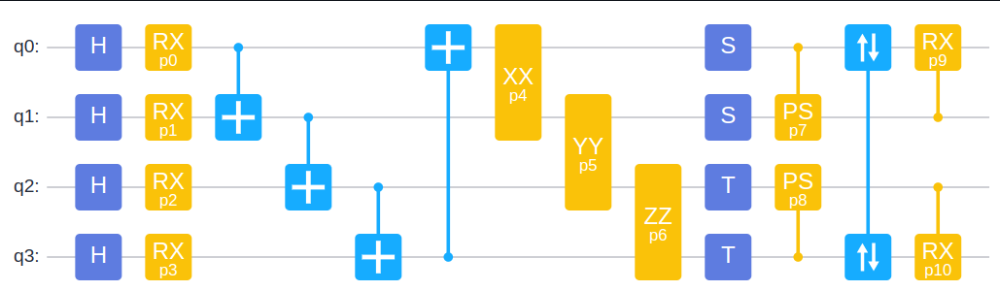
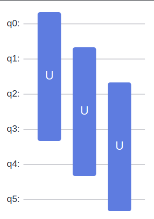
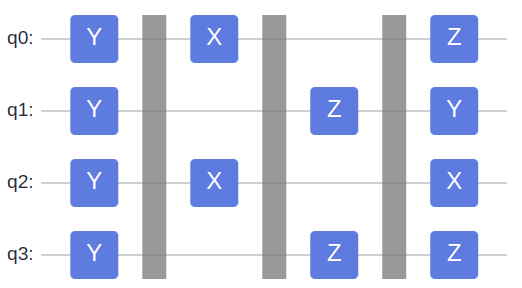

# Benchmark

## Frameworks

|框架名称|公司|版本号|CPU|GPU|变分|Python API|
|-|-|-|-|-|-|-|
|MindQuantum|华为|0.8.0|✅|✅|✅|✅|
|qiskit|IBM|0.38.0|✅|✅|✅|✅|
|intel_qs|Intel|2.0.0-beta|✅|❌|❌|❌|
|paddle quantum|Baidu|2.2.1|✅|✅|✅|✅|
|tensorflow quantum|Google|0.7.2|✅|✅|✅|✅|
|qulacs|Qulacs|0.5.2|✅|✅|✅|✅|
|quest|QuEST|3.5.0|✅|✅|✅|❌|
|tensorcircuit|Tencent|0.5.0|✅|✅|✅|✅|

## Benchmark task

量子线路或者哈密顿量由框架自己生成，不由其他框架转化。

|任务名称|描述|比特范围|哈密顿量项数|量子门个数|OMP|Layer|
|-|-|-|-|-|-|-|
|random_circuit_qs|随机量子线路振幅模拟|4-24|/|25*n|1-8|/|
|random_circuit_gradient|随机参数化量子线路梯度计算|4-24|1, Y1|25*n|1-8|/|
|random_hamiltonian_expectation|随机哈密顿量期望值|4-24|$\min(1000-100, n_\text{qubit}^4)$|/|1-8|/|
|maxcut_random_2_regular_with_qaoa|利用qaoa解决随机2-regular的maxcut问题|4-24|/|/|1-8|1|

## Task Detail

### random_circuit_gradient

4比特线路模板

线路扩展

测量哈密顿量

$$Y_1$$

### random_circuit_qs

与上述任务相同，将所有参数门参数选为随机值即可。

### random_hamiltonian_expectation

初始态为均匀叠加态。

4比特模板：

扩展方式与上述任务相同。

### maxcut_random_2_regular_with_qaoa

随机的2-regular图，seed=42。

## Conclution

### Qulacs

Parameter shift (relative slow) and adjoint gradient (relative fast).
Only support rx, ry, rz, rot_pauli, only **CPU**.
